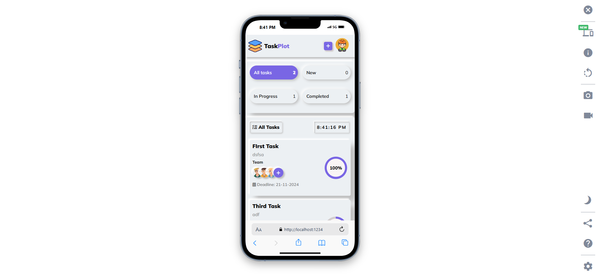
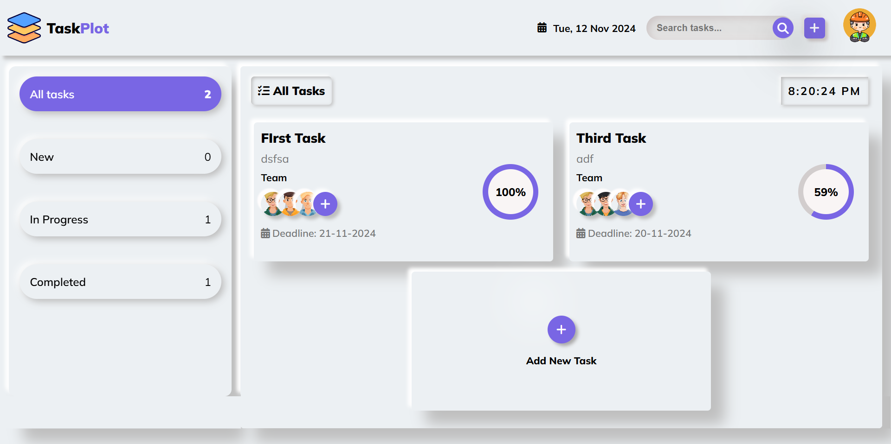

# 📝 "TaskPlot: A Task Management Application"

     

## 📌 Overview

This **Task Management Application** helps users efficiently manage their tasks by categorizing them into **All, New, In Progress,** and **Completed** sections. Built using **HTML, CSS, JavaScript**, and bundled with **Parcel**, this application follows an **OOP design pattern** and uses **local storage** for data persistence.

---

## 🌐 Live Link

Check out the live application here: [TaskPlot Live](https://your-live-link.com)

---

## 📸 Screenshots

| Device      | Screenshot                                            |
| ----------- | ----------------------------------------------------- |
| **Mobile**  |    |
| **Desktop** |  |

---

## 🌟 Features

- **Add, Edit, and Delete Tasks:** Effortlessly manage tasks with options to edit or delete them.
- **Category-based View:** View tasks by status: All Tasks, New Tasks, In Progress, Completed.
- **Category-wise Task Count:** See the count of tasks within each category.
- **Search by Title:** Quickly find tasks using a search feature.
- **Persistent Storage:** All tasks are saved in local storage, ensuring data retention after page refresh.
- **Responsive Design:** Designed to be responsive across various devices.
- **The application follows an Object-Oriented Programming (OOP) design pattern.**

---

## 💻 Technologies

| Technology | Description                                    |
| ---------- | ---------------------------------------------- |
| HTML       | Markup language for structuring pages          |
| CSS        | Styling for responsive, user-friendly UI       |
| JavaScript | Programming language for functionality         |
| Parcel     | Bundler for efficient loading and optimization |

---

## 🚀 Installation

1. Clone this repository:
   ```bash
   git clone https://github.com/Abdur-Rahman-Apu/TaskPlot.git
   ```
2. Navigate to the project directory:
   ```bash
   cd TaskPlot
   ```
3. Install the dependencies:
   ```bash
   npm install
   ```
4. Start the application:

   ```bash
   npm start
   ```

---

## 🛠️ Usage

1. **Adding Tasks:** Click on the "Add Task" button and enter details.
2. **Editing Tasks:** Click on the task and select "Edit."
3. **Deleting Tasks:** Click on the delete icon next to a task.
4. **Viewing by Category:** Use the category filter to view tasks by status.
5. **Search:** Enter keywords in the search bar to find tasks by title.

---

## 👤 Author

**Abdur Rahman Apu**

- LinkedIn: [Abdur Rahman Apu](https://www.linkedin.com/in/abdur-rahman-apu/)
- GitHub: [Abdur-Rahman-Apu](https://github.com/Abdur-Rahman-Apu)

---

## 🙏 Acknowledgments

Special thanks to:

- **JavaScript Ninja Bootcamp** for the inspiration to build this project.
- **Parcel** for offering an easy-to-use bundling solution.
- All contributors to open-source libraries that made this project possible.

---

## 📜 License

This project is licensed under the MIT License - see the [LICENSE](LICENSE) file for details.

---

## ⭐ Give a Star

If you found this project helpful or learned something from it, please give it a ⭐ on GitHub! Your support is greatly appreciated and motivates me to keep building and improving projects like this.

---

Enjoy managing your tasks! 🏆
